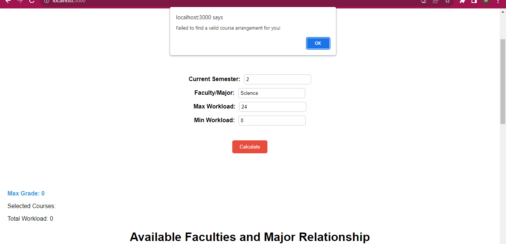
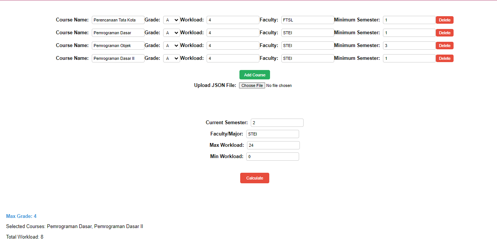
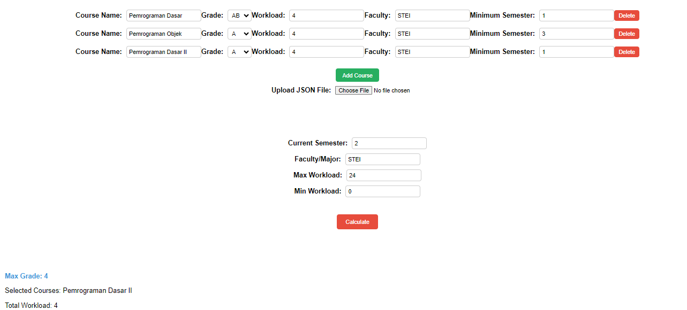
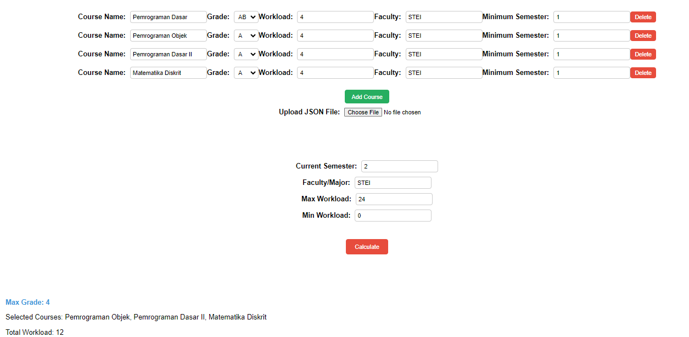
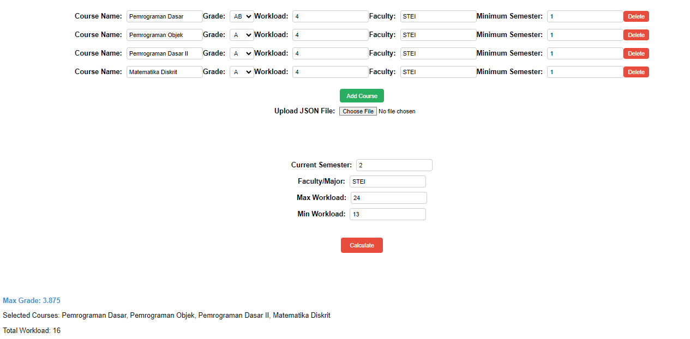
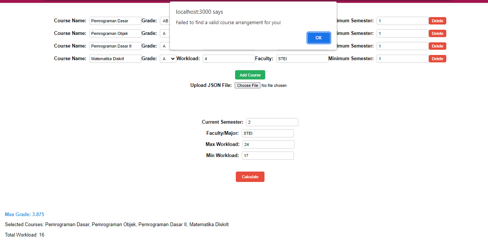
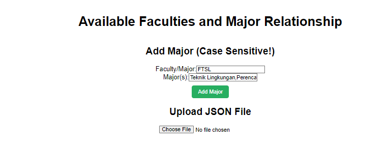
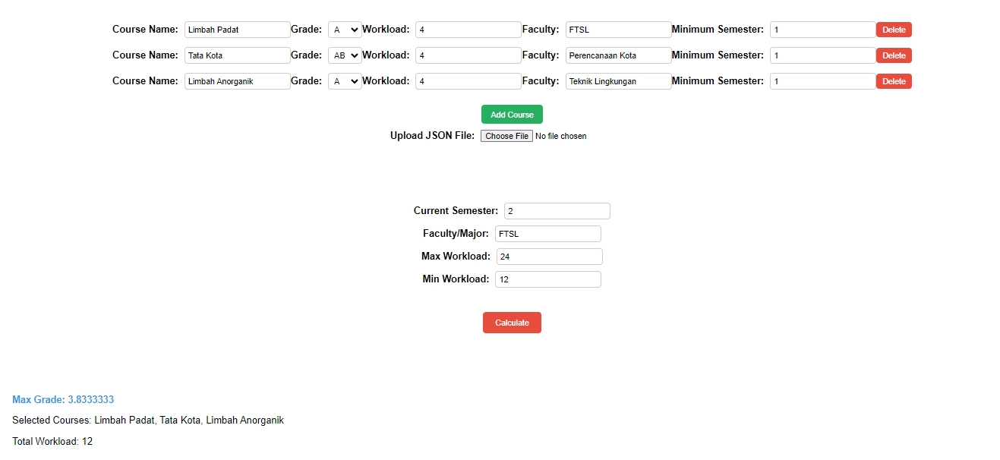
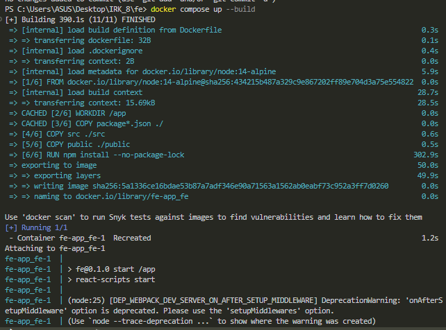

# Course Selector - Memaksimalkan IP dengan Dynamic Programming
## Deskripsi Program
Course Selector adalah sebuah program yang menggunakan teknik dynamic programming untuk membantu mahasiswa dalam memilih mata kuliah yang akan diambil di semester ini dengan tujuan memaksimalkan Indeks Prestasi (IP) mereka. Program ini akan memberikan rekomendasi kombinasi mata kuliah yang memungkinkan mahasiswa mendapatkan IP terbaik, sambil juga mempertimbangkan Beban SKS (Satuan Kredit Semester) yang dapat diambil sebanyak mungkin. Mata kuliah yang dipilih harus memenuhi syarat minimum semesternya dan diajarkan di fakultas yang sama.

Sebagai contoh, seorang mahasiswa dari program studi Teknik Informatika dapat mengambil mata kuliah yang diajarkan di fakultas yang relevan seperti Teknik Elektro, STEI, dan lainnya.

## Teknologi dan Framework
Program ini dibangun dengan menggunakan teknologi dan framework berikut:

Backend: Bahasa pemrograman GO digunakan sebagai bahasa utama untuk mengembangkan bagian backend dari aplikasi. Database MySQL digunakan untuk menyimpan informasi mengenai mata kuliah, syarat minimum, dan informasi lain yang diperlukan.

Frontend: Antarmuka pengguna dibangun menggunakan framework React, yang memberikan pengalaman pengguna yang interaktif dan responsif.

## Pengujian
1. Tidak Ada Mata Kuliah Valid

2. Ada Mata Kuliah Yang Valid (Semester Minimum, Fakultas, dst)

3. Mengurangi SKS karena ada yang bisa mengurangi indeks.

4. Mengambil course sebanyak-banyaknya selama IP setinggi mungkin.

5. Terpaksa mengambil IP < 4 karena batasan minimal SKS

6. Minimal SKS terlalu tinggi

## Bonus 
1. Hubungan fakultas-course

2. Semua matkul di bawah 1 fakultas dapat diambil

## Cara Menjalankan Aplikasi (docker-compose up -d)
docker-compose up -d

## Referensi Belajar
1. https://legacy.reactjs.org/tutorial/tutorial.html
2. Youtube, Imre Nagi, Docker